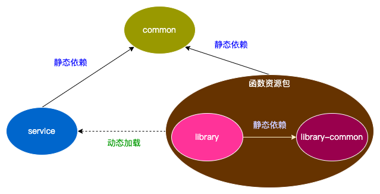

# reloading demo



- source: maven-source-plugin
- with dependencies(fat jar): maven-assembly-plugin
- build different packages: maven-jar-plugin
- build different modules: profiles

## build different modules

[pom.xml](library/pom.xml)

```xml
<profile>
    <id>le</id>
    <properties>
        <maven.test.skip>true</maven.test.skip>
    </properties>
    <modules>
        <module>library-en</module>
    </modules>
</profile>
<profile>
    <id>lc</id>
    <properties>
        <maven.test.skip>true</maven.test.skip>
    </properties>
    <modules>
        <module>library-cn</module>
    </modules>
</profile>
```

lib-cn

```bash
mvn clean package -P lc
```

lib-en

```bash
mvn clean package -P le
```

lib

```bash
mvn clean package -P le -P lc
```

## UT

```java
@Test
public void testFnReload() throws Exception {
    Hello enHello = fnReLoader.reloadHello("demo.hello.saying.en");
    assertEquals(enHello.sayHello(), "Hello");
    log.info("en hello:{}", enHello.sayHello());
    
    Hello cnHello = fnReLoader.reloadHello("demo.hello.saying.cn");
    assertEquals(cnHello.sayHello(), "你好");
    log.info("cn hello:{}", cnHello.sayHello());
}
```
